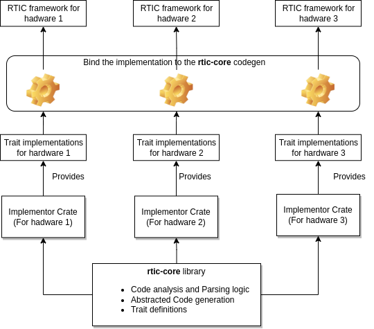

# Modular RTIC and POC for a multi-core extension on rp2040

**Experiment Objective:** 

The objective of this experiment is to enhance the scalability of the RTIC (Real-Time Interrupt-driven Concurrency) framework, particularly to allow for multicore hardware configurations. The goal is to decouple the RTIC declarative model from hardware-specific implementation details. And (possibly) provide a mechanism for additional syntax extention through 3rd party libraries. By achieving this, we aim to create a more maintainable and extensible RTIC framework capable of accommodating various hardware configurations while preserving the original core declarative model.


### Glossary

- `RTIC distribution`: 

- `rtic-core` is a library created during these experiment that is completely different from the other `rtic-core` crate in the original RTIC project. This library (as will be explained in details later) does all the heavy lifting for allowing the creation of an `RTIC distribution`
- `internal extended features (internal passes):` in short....
- `plug-ins (external passes):` in short....


## Declarative model for single-core, multi-core applications, and user plug-ins

before looking into the nasty implementation details, let's first get an overview how different RTIC applications should look like.


**NOTE1:** Because this is just an experiment, `rtic-core` implements only a subset of the Original RTIC declarative model. Currently only Init, idle, Hardware task, Software tasks with message passing, local and shared resources are provided ( monotonics, and async not implemented yet)

**NOTE about changed syntax:** the way of **declaring a task now uses a struct that implements a specific task trait instead of a function** with Context,  the way of **defining local resources is by defining member variables of the Task struct**. and finally, shared resources are accessed through the `shared()` API, instead of using Context. The reason for this change is purely because this allows rapid prototyping due to the fact that it is much easier/faster to implement such model (and also feels less complicated for first time users IMHO).


#### Single core application

```rust
#[rp2040_rtic::app(
    device=rp2040_hal::pac,
    dispatchers= [TIMER_IRQ_2]),
]
pub mod my_single_core_app {

    // user includes ...
    
    #[shared]
    struct SharedResources {
        shared1 : Type,
        shared2 : Type,
    }

    #[init]
    fn init() -> SharedResources {
        // init code ....
        SharedResources { 
        	shared1 : val,
            shared2 : val,
        }
    }

    #[task(binds = TIMER_IRQ_0 , priority = 3, shared = [shared1, shared2])]
    struct MyHwTask {
        /* local resources */
        local_resource1 : bool,
    }
    impl RticTask for MyHwTask {
        fn init() -> Self {
            Self { /* init local resources */ }
        }

        fn exec(&mut self) {
            
            // locking a resource
            self.shared().shared2.lock(|shared2| {
                //do something with `shared2` in a critical section
            });
            
            // using a local resource
            if  self.local_resource1 {
                // do something
                 self.local_resource1 = false
            } else {
                // do something else
            }
            
            // spawning a software task
            if let Err(val) =  MySwTask::spawn(7) {
                // do something on error case,
            }
            
        }
    }
        
    #[task(priority = 1, shared = [shared2])]
    struct MySwTask {
        /* local resources */
    }
    impl RticSwTask for MySwTask {
        type TaskInputType = u8;
        
        fn init() -> Self {
            Self { /* init local resources */ }
        }

        fn exec(&mut self, input: u8) {
            // do something with input
            // lock `shared2` resource 
            // use your creativity
        }
    }
    
    #[idle(shared = [shared1])]
    struct MyIdleTask {
        /* local resources */
    }
    impl RticIdleTask for MyIdleTask {
        fn init() -> Self {
            Self { /* init local resources */ }
        }

        fn exec(&mut self) -> ! {
            loop { /* ... */ }
        }
    }

    
}
```

in **Cargo.toml** of this application the feature `sw_tasks` must be enabled to allow the use of the `dispatchers = [...]` attribute and to allow declaring software tasks. Similarly, if the user wants to use some extended features of RTIC (such as monotonics or async) , the user can enable such *<u>internal-extensions</u>* through their appropriate features. Note however, that not all **rtic distributions** will support all the internal-extensions and it is up to the **distributor** to support and expose a sub-set or all features allowed by `rtic-core`. 

   

#### Multi-core RTIC application

```rust
// include plug-in proc macros here
use plug_in_macro_lib1;
use plug_in_macro_lib2;
use plug_in_macro_lib3;

#[rp2040_rtic::app(
    device = rp2040_hal::pac,
    // declare plug-ins (the macros will be called in)
    plugins = [plug_in_macro_lib1, plug_in_macro_lib2, plug_in_macro_lib3],
]
pub mod my_single_core_app {

    // user includes ...
    
    #[shared]
    struct SharedResources {
        shared1 : Type,
        shared2 : Type,
    }

    #[init]
    fn init() -> SharedResources {
        // init code ....
        SharedResources { 
        	shared1 : val,
            shared2 : val,
        }
    }

    #[task(binds = TIMER_IRQ_0 , priority = 3, shared = [shared1, shared2])]
    struct MyHwTask {
        /* local resources */
        local_resource1 : bool,
    }
    impl RticTask for MyHwTask {
        fn init() -> Self {
            Self { /* init local resources */ }
        }

        fn exec(&mut self) {
            
            // locking a resource
            self.shared().shared2.lock(|shared2| {
                //do something with `shared2` in a critical section
            });
            
            // using a local resource
            if  self.local_resource1 {
                // do something
                 self.local_resource1 = false
            } else {
                // do something else
            }
            
            // spawning a software task
            if let Err(val) =  MySwTask::spawn(7) {
                // do something on error case,
            }
            
        }
    }
        
    #[task(priority = 1, shared = [shared2])]
    struct MySwTask {
        /* local resources */
    }
    impl RticSwTask for MySwTask {
        type TaskInputType = u8;
        
        fn init() -> Self {
            Self { /* init local resources */ }
        }

        fn exec(&mut self, input: u8) {
            // do something with input
            // lock `shared2` resource 
            // use your creativity
        }
    }
    
    #[idle(shared = [shared1])]
    struct MyIdleTask {
        /* local resources */
    }
    impl RticIdleTask for MyIdleTask {
        fn init() -> Self {
            Self { /* init local resources */ }
        }

        fn exec(&mut self) -> ! {
            loop { /* ... */ }
        }
    }

    
}
```


#### Syntax/Functionality extension through 3rd party plug-ins 

```rust

```


### Implementation details

#### rtic-core, distributions and internal-extensions


**Approach:**

**Note** that `rtic-core` library in this project/experiment is completely different from the other `rtic-core` crate in the original RTIC project, so these should not be confused.


To achieve modularity and separation of concerns, `rtic-core` library has been designed in a way such that it:

1. **Provides Parsing and Analysis Logic:** The `rtic-core` library contains all the  logic required for parsing and analyzing an RTIC application. 

2. **Abstract Code Generation:** `rtic-core` abstracts most of the code generation process, ensuring that it remains hardware-agnostic. However, when hardware-specific code is necessary, the library facilitates the integration of such details using a **Plug-in mechanism** which any arbitrary external crate known as the `implementor crate` can provide the hardware specific implementation details.

3. **Plug-in Mechanism:** The integration of hardware-specific details is facilitated through a plug-in mechanism. The is mechanism works by exposing a set of traits, Each trait defined by `rtic-core` represents a distinct aspect of the RTIC framework, such as core functionality (like resource locking), and other functionality like  monotonics ..etc.

   These traits define a contract for how the implementor should provide the hardware-specific details.

   The `implementor crate`, which serves as the actual RTIC proc macro used by the user, leverages these traits to provide hardware-specific implementations. In addition, this approach allows extending the RTIC declarative model beyond what `rtic-core` provides, such as adding multi-core support for some specific target.




#### Example of Implementing RTIC framework for rp2040 by using `rtic-core`

If we assume that `rp2040-rtic` is a proc-macro crate then, `rtic-core` can be used within it as follows:

1) Implement the `RticCoreImplementor` trait: 

```rust
use proc_macro::TokenStream;
use quote::quote;
use rtic_core::{ParsedRticApp, RticCoreImplementor};
extern crate proc_macro;

struct Rp2040Rtic;

impl RticCoreImplementor for Rp2040Rtic {
    fn get_default_task_prio(&self) -> u16 {0}
    fn get_min_task_prio(&self) -> u16 {1}
    fn get_max_task_prio(&self) -> u16 {3}

    fn pre_init(&self, app_info: &rtic_core::ParsedRticApp) -> Option<proc_macro2::TokenStream> {
        // implementation of pre-initialization code, this can for example include enabling interrupts
        // and setting their priorities. All the information needed about the used interrupts used
        // in the application and their associated priorities can be found in `app_info`.
       	None
    	}

    fn critical_section_begin(&self) -> proc_macro2::TokenStream {
        // example
        quote! {
            unsafe { core::arch::asm!("cpsid i"); }
        }
    }

    fn critical_section_end(&self) -> proc_macro2::TokenStream {
        // example
        quote! {
            unsafe { core::arch::asm!("cpsie i" ); }
        }
    }

    fn wfi(&self) -> Option<proc_macro2::TokenStream> {
        // example
        Some(quote! {
            unsafe { core::arch::asm!("wfi" ); }
        })
    }

    fn compute_priority_masks(&self, app_info: &ParsedRticApp) -> proc_macro2::TokenStream {
        /* see how this is implemented in rp2040-rtic */
    }

    fn impl_lock_mutex(&self) -> proc_macro2::TokenStream {
        /* see doc comment in `rtic-core` for this function for more details */
        /* rtic::export::lock() function is located in `rp2040-rtic/src/export.rs` */
        quote!{
            unsafe {rtic::export::lock(resource, task_priority, CEILING, &__rtic_internal_MASKS, f);}
        }
    }

}
```


2) provide the implementation to `RticAppBuilder` and let it handle the rest:

```rust
use rtic_core::RticAppBuilder;

#[proc_macro_attribute]
pub fn rp2040_rtic(args: TokenStream, input: TokenStream) -> TokenStream {
    // pass the implementation to RticAppBuilder and call parse(), its that simple !
    let mut builder = RticAppBuilder::new(Box::new(Rp2040Rtic));
    // builder.monotonics(Box::new(Rp2040RticMonotonics));
    // builder...
    builder.parse(args, input);
    
}
```


For a real example see `rp2040-rtic`.


### The declarative model `rtic-core` provides:

-  [blinky.rs](rp2040-rtic/examples/blinky.rs) is a very simple example that showcases  the `rtic-core` declarative model for a single core application
- [blinky_expanded.rs](rp2040-rtic/examples/blinky_expanded.rs) shows what the application expands to


### Multi-core declarative model for the rp2040

One possible model for declaring a multicore application on the RP2040 can be structured as follows:

- Each core has its own RTIC application, encompassing core-local shared resources and tasks.
- Applications can communicate between each other through message passing by spawning software tasks on the other core.


While this model hasn't been implemented yet (work in progress), theoretically, utilizing the `rtic-core` library in `rp2040-rtic` would enable the creation of multi-core applications following this paradigm:

```rust

#[rp2040_rtic::app(device=rp2040_hal::pac, core = 1)]
pub mod core1_app {

    // user includes ...
    
    #[shared]
    struct SharedResources {
        // core local shared resources ....
    }

    #[init]
    fn core1_init() -> SharedResources {
        // init code ....
        SharedResources { // .... }
    }

    #[hw_task(binds = TIMER_IRQ_0 , priority = 1, shared = [/*core local shared resources go here*/])]
    struct MyTask {
        /* local resources */
    }
    impl RticTask for MyTask {
        fn init() -> Self {
            Self { /* init local resources */ }
        }

        fn exec(&mut self) {
            // execute some code on core1 ...
            core2_app::MySwTask::spawn(core2_app::MySwTaskMsg {/*message*/}).unwrap(); // schedule on core2
            
            // execute some code on core 1...
            self.shared().<resource_name>.lock(|rec| {
                //do something
            });
            // ....
        }
    }

    
}


#[rp2040_rtic::app(device=rp2040_hal::pac, core = 2, dispatchers = [TIMER_IRQ_1])]
pub mod core2_app {

    // user includes ...
    
    #[shared]
    struct SharedResources {
        // core local shared resources ....
    }

    #[init]
    fn core2_init() -> SharedResources {
        // init code ....
        SharedResources { // .... }
    }

    #[sw_task( priority = 1, shared = [/*core local shared resources go here*/])]
    pub struct MySwTask {
        /* local resources */
    }
    impl SwRticTask for MySwTask {
    	MsgType = MySwTaskMsg;
    	
        fn init() -> Self {
            Self { /* init local resources */ }
        }

        fn exec(&mut self, message: MySwTaskMsg) {
            // execute some code on core 2...
        }
    }
    
    pub struct MySwTaskMsg {/*message*/}

    
}

```


#### How can `rtic-core` library facilitate the implementation of this model ?

There are two problems that we need to solve if we need to make the multi-core extension for the RP2040:

##### 1. Core1 has to initialize Core2, and how can this be hidden from the user:

This problem can be solved by implementing `RticCoreImplementor` **twice**;

-  where in Core1 implementation of `RticCoreImplementor` trait, the  `pre_init()` function will include **initializing core2 and waking it up** in addition to other common pre-initialization code like enabling local interrupts and setting up their priorities.  
- So, when the `rp2040_rtic` proc-macro function gets called the first time to parse the first RTIC application and it sees the attribute `core = 1`, then It passes Core1 implementation of `RticCoreImplementor` to `RticAppBuilder`. 


##### 2. Message passing, local vs multi-core:

single core message passing support in `rtic-core` will soon be added, this will include:

- generating a **ready-queue** for each priority level 
- generating a **inputs-queue** for each task
- generating a **finished-queue** for each task
- binding the software task to the appropriate dispatcher
- However, the actual implementation of the `pend(irq)` function using in triggering the dispatcher will be requested from the **Implementor** though the   `RticCoreImplementor` trait to provide the hardware specific details. 


The multi-core extension, however, will present the following two challenges (especially the second):

1. a different `pend()` function needs to be used when doing cross-core message passing. and as a solution, the `rtic-core` library, can facilitate this by exposing an optional function in `RticCoreImplementor` called `cross_pend()` which abstracts the implementation  of or cross-node interrupt pending.
2. the second challenge is how the access to the **read, inputs and finished** queues can be governed in the case of two or more cores and how can this be abstracted away
   1. one approach could be to protect these **queues**  using hardware spinlocks  
   2. another approach, would be to have separate queues (one for core-local message passing and another for cross-core message passing) but this will also introduce some overhead in dispatching tasks and will need to be generic enough to be abstracted away in `rtic-core`

The solution to the second challenge is yet to be determined...


